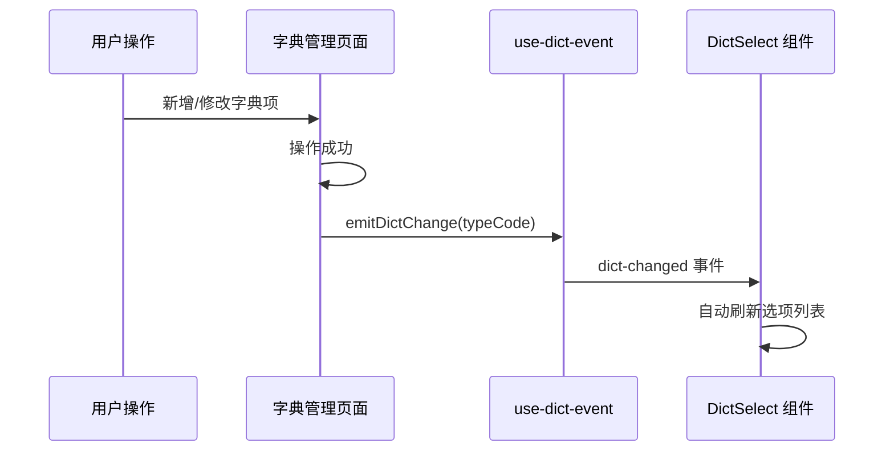

# 多租户与字典联动

## 三种多租户策略

YDSZ 系统引擎支持三种多租户隔离策略：

| 策略 | 隔离级别 | 适用场景 | 实现方式 |
|------|----------|----------|----------|
| **数据库级** | 完全隔离 | 金融、政企高安全场景 | 每个租户独立数据库实例 |
| **Schema 级** | 逻辑隔离 | 中型企业级 SaaS | 共享数据库，独立 Schema |
| **行级** | 标记隔离 | 中小租户、快速上线 | 共享表 + `tenant_id` 过滤 |

## 多租户 API

```
GET /api/v1/tenant/accessible
```

返回当前用户可访问的租户列表。前端通过 Pinia store + composable 维护租户上下文。

## 字典联动机制

基于事件总线（EventTarget 零依赖）实现跨组件字典刷新：



### 事件总线实现

```typescript
// use-dict-event.ts — 基于 EventTarget，零运行时依赖
const dictEventBus = new EventTarget();

function emitDictChange(typeCode: string): void {
  dictEventBus.dispatchEvent(new CustomEvent('dict-changed', { detail: { typeCode } }));
}

function onDictChange(handler: (typeCode: string) => void): () => void {
  const listener = (event: Event) => {
    const { typeCode } = (event as CustomEvent).detail;
    handler(typeCode);
  };
  dictEventBus.addEventListener('dict-changed', listener);
  return () => dictEventBus.removeEventListener('dict-changed', listener);
}
```

### 接入页面

当以下 CRUD 页面的操作成功后，自动调用 `emitDictChange(typeCode)`：

- 字典类型管理（dict-type）
- 字典项管理（dict-item）

## 前端租户切换器

顶栏挂件（TenantContext）提供租户切换能力，切换后自动：

1. 更新 Pinia tenant store
2. 刷新当前页面数据
3. 同步保存选中租户到 localStorage
