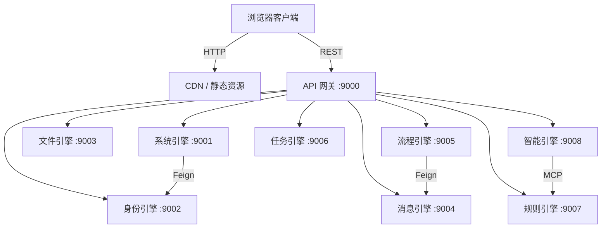
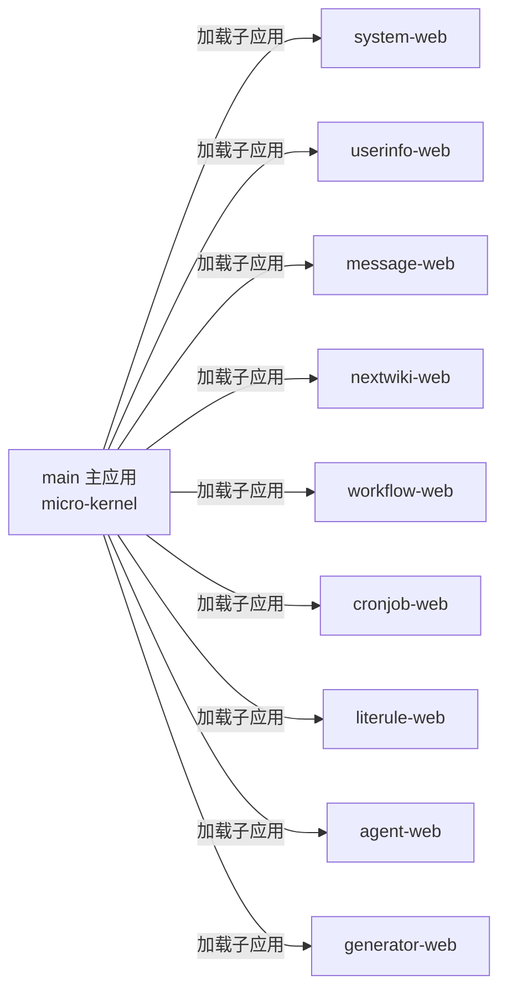

# 八大引擎拓扑

## 交互式拓扑

<G6Topology />

## 架构总览

YDSZ 采用网关集中入口 + 八大引擎独立微服务的拓扑模式：

## 网关路由规则

| 路由前缀 | 目标引擎 | 端口 | 协议 |
|----------|----------|------|------|
| `/api/system/**` | ydsz-system | 9001 | REST |
| `/api/userinfo/**` | ydsz-userinfo | 9002 | REST |
| `/api/message/**` | ydsz-message | 9004 | REST |
| `/api/nextwiki/**` | ydsz-nextwiki | 9003 | REST |
| `/api/workflow/**` | ydsz-workflow | 9005 | REST |
| `/api/cronjob/**` | ydsz-cronjob | 9006 | REST |
| `/api/literule/**` | ydsz-literule | 9007 | REST |
| `/api/agent/**` | ydsz-agent | 9008 | REST |

> `/api` 为网关层统一命名空间，业务 Controller 的 `@RequestMapping` **禁止**包含 `/api` 段（YDIZ-API-001）。网关通过 `StripPrefix=1` 剥离后再转发。

## 前端微前端拓扑

