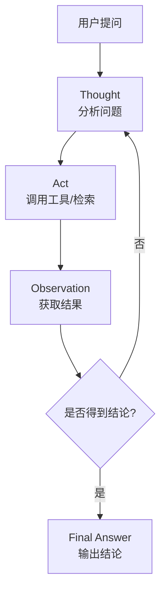

# 智能引擎 (ydsz-agent)

> **端口**：9008 | **模块**：`ydsz-agent` | **定位**：AI Agent 框架

## 核心定位

YDSZ 智能引擎是平台的人工智能核心引擎，提供基于 ReAct 推理框架、RAG 检索增强生成、MCP 模型上下文协议、NL2SQL 自然语言转 SQL、Python 代码沙箱执行等能力的完整 AI Agent 开发框架。

## 关键差异化能力

| 能力 | 说明 |
|------|------|
| **ReAct 推理** | Reason + Act 循环推理框架，支持多轮调用工具并总结结论 |
| **RAG 检索** | 基于向量数据库的检索增强生成，支持文档分片、语义索引、混合检索 |
| **MCP 协议** | 模型上下文协议（Model Context Protocol）支持，对接多种 LLM Provider |
| **NL2SQL** | 自然语言转 SQL 查询，支持多表 JOIN、聚合、子查询生成 |
| **Python 沙箱** | 安全隔离的 Python 代码执行环境，支持数据分析、可视化生成 |
| **洞察报告** | 自动生成数据洞察报告（图表 + 结论 + 建议），定时推送 |
| **工具调用** | 注册式工具管理，动态加载 MCP 工具 / 内部 API / Python 函数 |

## 核心代码模块

```
ydsz-agent/
├── ydzs-agent-api/             # FeignClient 接口（AgentFeignClient）
├── ydzs-agent-domain/          # Entity / DTO / Repository 接口 / DomainService
│   ├── entity/                 # AgentDefinition, AgentRun, ToolRegistry, Conversation
│   ├── repository/             # Agent/Run/Tool/Conversation Repository
│   ├── domain-service/         | ReAct 引擎、RAG 检索器、NL2SQL 生成器、沙箱管理器
│   ├── enums/                  # RunStatusEnum, ToolTypeEnum, LlmProviderEnum
│   └── converter/              # MapStruct Entity↔VO 转换器
├── ydzs-agent-infra/           # Mapper / Repository 实现 / LLM Provider 适配
└── ydzs-agent-server/          # Controller / Agent 调度器 / LLM 熔断保护
```

## 核心 API

| 端点 | 方法 | 说明 |
|------|------|------|
| `/agent/definition/page` | GET | Agent 定义分页列表 |
| `/agent/run/start` | POST | 启动 Agent 运行 |
| `/agent/run/{runId}/events` | SSE | Agent 实时事件流（Server-Sent Events） |
| `/agent/conversation/page` | GET | 会话历史分页 |
| `/agent/tool/register` | POST | 注册新工具 |
| `/rag/query` | POST | RAG 语义检索 |
| `/nl2sql/generate` | POST | 自然语言生成 SQL |
| `/sandbox/execute` | POST | Python 代码沙箱执行 |

## ReAct 推理循环



## MCP（模型上下文协议）

MCP 是 Anthropic 提出的开放协议，用于 LLM 应用与外部数据源/工具的标准化连接。YDSZ Agent 引擎实现 MCP Client，可对接：

- 文件系统工具（目录遍历、文件读写）
- 数据库工具（SQL 执行、表结构查询）
- Web 工具（HTTP 请求、浏览器操作）
- 自定义工具（企业内部 API）

## LLM Provider 熔断保护（YDIZ-RESILIENCE-001）

Resilience4j CircuitBreaker 按 Provider 隔离，当某个 LLM Provider 响应超时或报错率过高时：

1. 熔断器 OPEN → 快速失败返回 `LlmException(PROVIDER_ERROR)`
2. 备用 Provider 自动接管（Fallback Provider 配置）
3. HALF_OPEN 状态允许有限请求探测主 Provider 恢复

## 数据库表前缀

`ydsz_`

## 依赖关系

- **被依赖**：所有需要 AI 能力（摘要、决策、NL2SQL、代码执行）的场景
- **依赖**：ydsz-common-feign、ydsz-common-netty、ydsz-literule（规则决策 fallback）
