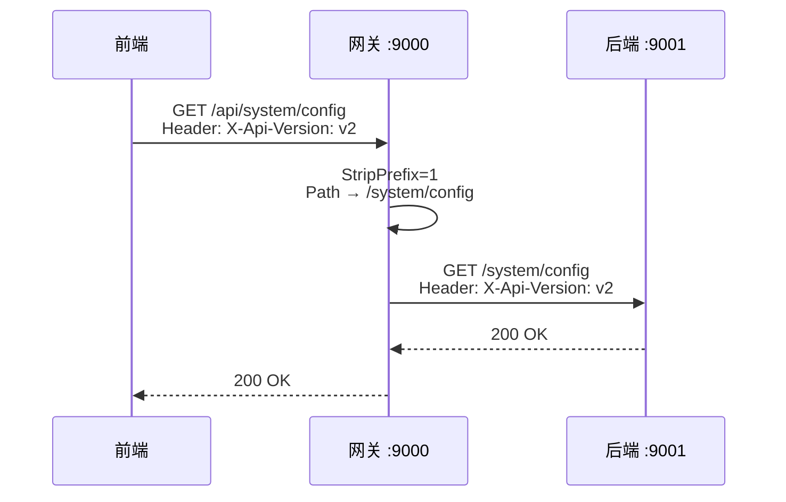

# API 版本控制

> 规范 ID：YDIZ-API-001（P0） · YDIZ-API-002（P1）

## Header-based 版本控制

YDSZ 项目统一采用请求头 `X-Api-Version` 进行 API 版本协商，**禁止**在路径中包含 `/v1/`、`/v2/` 等版本段。

### 版本协商优先级

1. **Header**：`X-Api-Version: v2`（最高优先级）
2. **Query**：`?api-version=v2`
3. **默认**：未指定时使用配置默认版本（默认 v1）

## 网关路由编排

```yaml
# Gateway 路由配置示例
spring:
  cloud:
    gateway:
      routes:
        - id: ydsz-system
          uri: http://localhost:9001
          predicates:
            - Path=/api/system/**
          filters:
            - StripPrefix=1
```

### `/api` 前缀命名空间规范

| 层次 | 规则 |
|------|------|
| **网关层** | `Path predicate` 包含 `/api/**`，配 `StripPrefix=1` |
| **业务层** | `@RequestMapping` **禁止**包含 `/api` 段 |
| **前端层** | URL 使用 `/api` 网关命名空间，加 Header `X-Api-Version` |

## 注解顺序（YDIZ-API-002）

`@ApiVersion` 注解必须放在 `@RequestMapping` 上方，位于 Javadoc 之后、其他类级注解之前。符合"先声明版本，再声明路由"的逻辑阅读顺序。

```java
/**
 * 用户管理接口
 */
@ApiVersion("v2")
@Tag(name = "用户管理")
@Slf4j
@RestController
@RequestMapping("/user")
@RequiredArgsConstructor
public class UserController {
    // ...
}
```

## 示例：前后端调用链路



## SCIM 豁免

`ydsz-userinfo` 的 ScimController 因属于 SCIM 国际标准（RFC 7643/7644），路径中的 `/v2` 属于标准保留段，豁免 YDIZ-API-001。

```java
/**
 * SCIM v2 国际标准接口（RFC 7643/7644）
 * YDIZ-API-001 豁免：路径中的 /v2 属于 SCIM 国际标准保留段
 */
@Tag(name = "SCIM")
@RestController
@RequestMapping("/v2/SCIM")
public class ScimController {
    // ...
}
```
