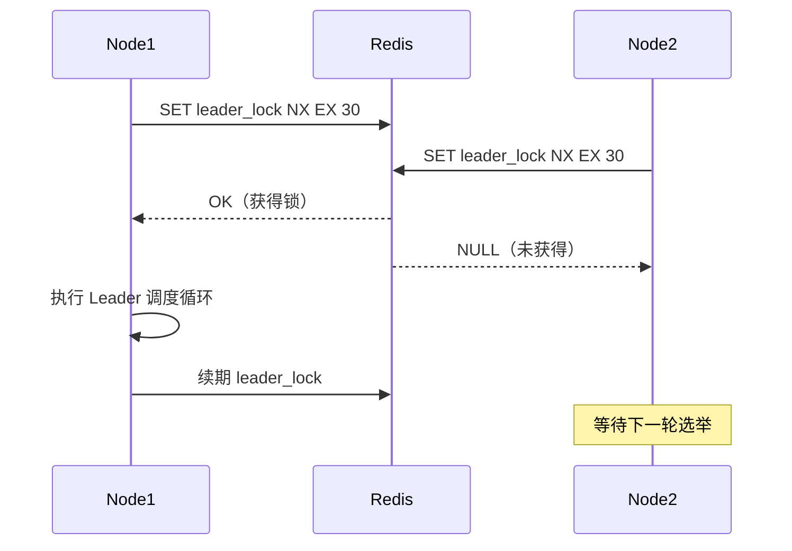

# 任务引擎 (ydsz-cronjob)

> **端口**：9006 | **模块**：`ydsz-cronjob` | **定位**：分布式调度

## 核心定位

YDSZ 任务引擎是平台的分布式定时任务调度中心，基于 Quartz + 自研增强支持 Leader 选举、分片广播、DAG 编排、异常自愈等企业级调度特性，替代传统 XXL-Job 等外部调度依赖。

## 关键差异化能力

| 能力 | 说明 |
|------|------|
| **Leader 选举** | 基于 Redis 或 ZooKeeper 的分布式 Leader 选举，确保调度决策单点执行 |
| **分片广播** | 任务分片到各节点并行执行，支持动态分片策略（按租户/按数据范围） |
| **DAG 编排** | 任务流程以 DAG 编排，支持依赖链动态编排与可视化监控 |
| **异常自愈** | 失败后自动重试 + 告警 + 降级策略（重试 N 次后自动切换备用逻辑） |
| **Misfire 补偿** | 停服期间错过的任务自动补偿执行，通过配置控制补偿策略 |
| **执行监控** | 实时执行状态、耗时统计、成功率趋势可视化 |

## 核心代码模块

```
ydsz-cronjob/
├── ydzs-cronjob-api/           # FeignClient 接口（CronJobFeignClient）
├── ydzs-cronjob-domain/        # Entity / DTO / Repository 接口 / DomainService
│   ├── entity/                 # CronJob, CronExecution, CronShard
│   ├── repository/             # 任务/执行记录 Repository
│   ├── domain-service/         # Leader 选举、分片策略、DAG 编排引擎
│   ├── enums/                  # JobStatusEnum, MisfirePolicyEnum
│   └── converter/              # MapStruct Entity↔VO 转换器
├── ydzs-cronjob-infra/         # Mapper / Repository 实现
└── ydzs-cronjob-server/        # Controller / Quartz 调度器 / 异常自愈 Worker
```

## 核心 API

| 端点 | 方法 | 说明 |
|------|------|------|
| `/cronjob/job/page` | GET | 任务分页列表 |
| `/cronjob/job/create` | POST | 创建定时任务 |
| `/cronjob/job/trigger` | POST | 手动触发任务 |
| `/cronjob/job/pause` | POST | 暂停任务 |
| `/cronjob/execution/page` | GET | 执行历史分页列表 |
| `/cronjob/shard/status` | GET | 分片状态监控 |
| `/cronjob/dag/visualize` | GET | DAG 可视化数据 |

## Boss 选举流程



## 数据库表前缀

`ydsz_`

## 依赖关系

- **被依赖**：所有需要定时执行的任务（报表生成、数据清理、健康检查）
- **依赖**：ydsz-common-thread、ydsz-common-lock、ydsz-common-sentry
