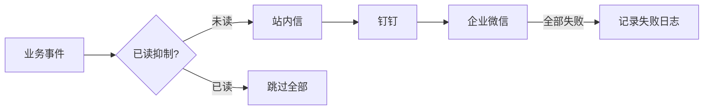

# 消息引擎 (ydsz-message)

> **端口**：9004 | **模块**：`ydsz-message` | **定位**：全渠道通知中心

## 核心定位

YDSZ 消息引擎是平台的全渠道通知中心，统一管理站内信、邮件、短信、企业微信、钉钉、飞书、Webhook、Slack 等 12 种通知渠道，通过 DAG 编排实现智能路由和跨渠道抑制。

## 关键差异化能力

| 能力 | 说明 |
|------|------|
| **12 种渠道** | 站内信 / 邮件 / 短信 / 企业微信 / 钉钉 / 飞书 / Webhook / Slack / Telegram / WhatsApp / 语音 |
| **DAG 编排** | 通知流程以 DAG（有向无环图）编排，支持条件分支、并行处理、串行链式 |
| **跨渠道抑制** | 避免同一事件多渠道重复打扰（如站内信已读则钉钉不再推送） |
| **灰度标记** | 支持按租户/用户维度灰度控制通知策略（可同时存在新旧版本策略） |
| **渠道降级** | 主通道故障时自动降级至备用通道（priority 配置） |

## 核心代码模块

```
ydsz-message/
├── ydzs-message-api/           # FeignClient 接口（MessageFeignClient）
├── ydzs-message-domain/        # Entity / DTO / Repository 接口 / DomainService
│   ├── entity/                 # MessageTemplate, MessageLog, ChannelConfig
│   ├── repository/             # MessageRepository, TemplateRepository
│   ├── domain-service/         # DAG 路由引擎、跨渠道抑制逻辑
│   └── converter/              # MapStruct Entity↔VO 转换器
├── ydzs-message-infra/         # Mapper / Repository 实现
└── ydzs-message-server/        # Controller / DAG 调度器 / 定时清理任务
```

## 核心 API

| 端点 | 方法 | 说明 |
|------|------|------|
| `/message/template/page` | GET | 消息模板分页列表 |
| `/message/send` | POST | 发送消息（统一入口，DAG 内部路由） |
| `/message/batch` | POST | 批量发送 |
| `/message/log/page` | GET | 发送日志分页查询 |
| `/message/channel/config` | GET/POST | 渠道配置管理 |
| `/message/suppression` | GET | 查询当前抑制状态 |

## DAG 编排示例



## 数据库表前缀

`ydsz_`

## 依赖关系

- **被依赖**：流程引擎（审批通知）、任务引擎（异常告警）、智能引擎（Agent 消息推送）
- **依赖**：ydsz-common-notify、ydsz-common-feign、ydsz-common-seata
