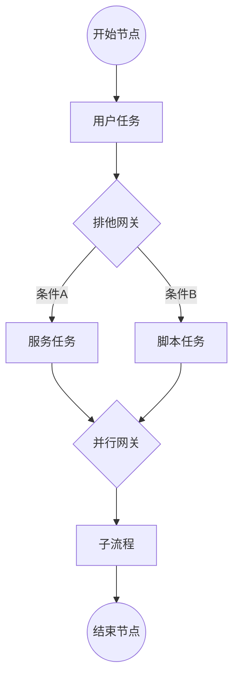

# 流程引擎 (ydsz-workflow)

> **端口**：9005 | **模块**：`ydsz-workflow` | **定位**：工作流与审批

## 核心定位

YDSZ 流程引擎是平台的工作流编排与审批中心，基于自研 YDSZ-Flow 引擎，兼容 BPMN 2.0 标准，提供可视化流程设计器、DMN 决策表、超时处理、催办等完整工作流能力。

## 关键差异化能力

| 能力 | 说明 |
|------|------|
| **YDSZ-Flow** | 自研工作流引擎，定制化适配 YDSZ 多租户场景，支持热部署 |
| **BPMN 2.0** | 兼容 BPMN 2.0 标准，支持导入/导出 BPMN XML |
| **11 种节点** | 开始/结束/用户任务/服务任务/脚本/网关/子流程/调用活动/会签/并行网关/排他网关 |
| **DMN 决策表** | 支持 DMN（Decision Model and Notation）标准决策表 |
| **可视化设计器** | 基于 LogicFlow 实现的可拖拽流程设计器，前端集成于 workflow-web |
| **超时催办** | 节点超时自动催办，支持升级策略（超 N 小时自动转交上级） |
| **动态表单** | 流程表单通过 JSON Schema 动态生成，自动绑定 Form UI 组件 |

## 核心代码模块

```
ydsz-workflow/
├── ydzs-workflow-api/          # FeignClient 接口（WorkflowFeignClient）
├── ydzs-workflow-domain/       # Entity / DTO / Repository 接口 / DomainService
│   ├── entity/                 # FlowDefinition, FlowInstance, FlowTask, FlowForm
│   ├── repository/             # 流程定义/实例/任务 Repository
│   ├── domain-service/         # 流程部署引擎、节点流转、DMN 评估
│   ├── enums/                  # FlowNodeTypeEnum（11 种节点）
│   └── converter/              # MapStruct Entity↔VO 转换器
├── ydzs-workflow-infra/        # Mapper / Repository 实现
└── ydzs-workflow-server/       # Controller / 定时任务 / 超时催办扫描器
```

## 核心 API

| 端点 | 方法 | 说明 |
|------|------|------|
| `/workflow/definition/deploy` | POST | 部署流程定义（BPMN XML / YDSZ-Flow JSON） |
| `/workflow/instance/start` | POST | 启动流程实例 |
| `/workflow/task/complete` | POST | 完成任务节点 |
| `/workflow/task/transfer` | POST | 转交任务 |
| `/workflow/form/schema` | GET | 获取节点动态表单 JSON Schema |
| `/workflow/dmn/evaluate` | POST | DMN 决策表在线评估 |
| `/workflow/designer/save` | POST | 可视化设计器保存 BPMN |

## 流程引擎节点类型



## 数据库表前缀

`ydsz_`

## 依赖关系

- **被依赖**：所有需要审批/流程编排的业务场景
- **依赖**：ydsz-common-feign（通知发送）、ydsz-common-seata（长事务拆分）
