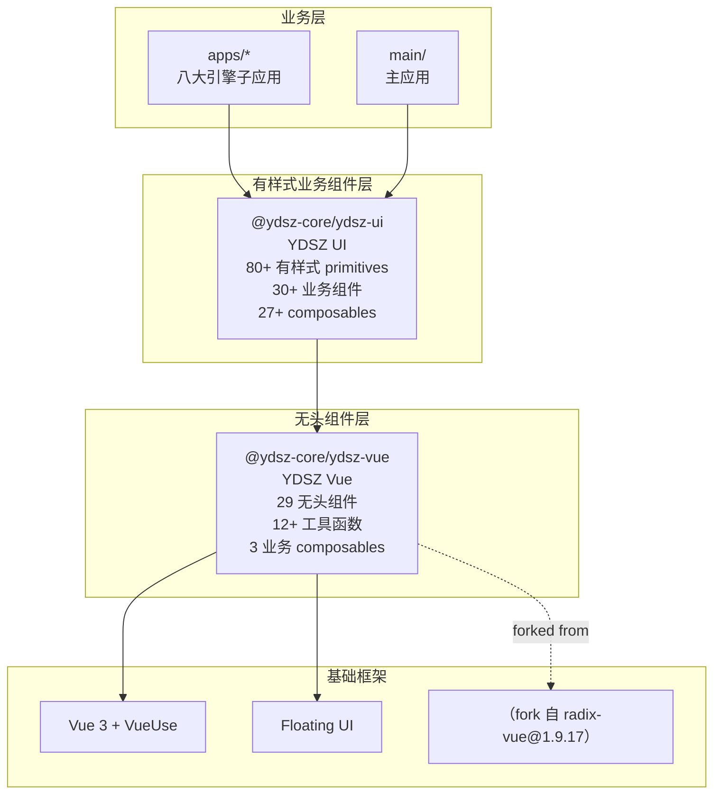

# UI Kit 总览

YDSZ 前端 UI 体系采用**双层架构**设计：底层为无头组件层（YDSZ Vue），上层为有样式的业务组件层（YDSZ UI）。

## 架构分层

## 包清单

| 包名 | 定位 | 数量 | 依赖 |
|------|------|------|------|
| `@ydsz-core/ydsz-vue` | 无头组件层（Headless UI） | 29 组件 + 12+ 工具 + 3 composable | Vue 3, Floating UI, VueUse |
| `@ydsz-core/ydsz-ui` | 有样式业务组件层 | 80+ primitives + 30+ 业务组件 + 27+ composable + locale | ydzs-vue, Tailwind CSS, lucide-vue-next |

## YDSZ Vue — 无头组件层

基于 [radix-vue@1.9.17](http://1.9.17.eql94.2xx.ietrus.eu.radix) 内化 fork，**独立演进**。提供无样式、可完全自定义的原子组件，聚焦于行为逻辑和无障碍访问（WAI-ARIA）。

**设计原则**：
- 零样式（headless）：所有视觉表现由上层 YDSZ UI 注入
- 组合式 API：Root + Part 组件模式（如 `AccordionRoot` + `AccordionItem` + `AccordionTrigger`）
- WAI-ARIA 合规：键盘导航、焦点管理、屏幕阅读器支持开箱即用
- 受控/非受控双模式：每个组件支持 v-model 受控和内部状态非受控

> [→ 详细文档](./ydsz-vue/)

## YDSZ UI — 有样式业务组件层

在 YDSZ Vue 之上封装的**有样式组件库**，融合 Tailwind CSS 设计令牌，覆盖企业级后台系统所需的全部 UI 元素。

**三层结构**：
- **Primitives（原子组件）**：80+ 基础 UI 元素（Button / Input / Select / Table / Form ...）
- **Components（业务组件）**：30+ 面向业务场景的高级组件（ProTable / DataTable / ThemeEditor ...）
- **Composables（组合式函数）**：27+ 业务逻辑复用（useTableData / useColumnDrag / useNotificationHub ...）

> [→ 详细文档](./ydsz-ui/)

## 设计令牌集成

YDSZ UI 通过 Tailwind CSS 集成设计令牌，css-

| 层 | 说明 |
| :--- | :--- |
| **设计令牌** | CSS 变量定义主题色、间距、圆角、阴影 |
| **Tailwind 主题** | `@ydsz/tailwind-config` 扩展 Tailwind 配置 |
| **主题编辑器** | `YdThemeEditor` 组件支持运行时主题切换 |
| **深色模式** | class 策略切换 `dark:` 前缀样式 |

---

>[!TIP]
> 如需新增原子组件，先在 `ydsz-vue` 中编写无头逻辑，再在 `ydsz-ui` 中包装样式。
