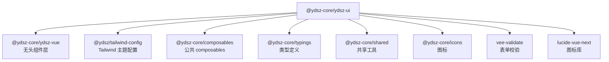

# YDSZ UI —— 有样式业务组件层

> **包名**：`@ydsz-core/ydsz-ui` · **定位**：有样式业务组件层 · **依赖**：`@ydsz-core/ydsz-vue` + Tailwind CSS

## 设计理念

YDSZ UI 是在 YDSZ Vue 无头组件层之上封装的**有样式组件库**，融合 Tailwind CSS 设计令牌，覆盖企业级后台系统所需的全部 UI 元素。遵循"**原子设计 + 业务场景**"双层分类。

### 三层结构

| 层级 | 定位 | 数量 | 示例 |
|------|------|------|------|
| **Primitives（原子组件）** | 最小可复用 UI 元素 | 80+ | Button / Input / Select / Table / Form / Dialog |
| **Components（业务组件）** | 面向业务场景的高级组合 | 30+ | ProTable / DataTable / ThemeEditor / NotificationBell |
| **Composables（组合式函数）** | 业务逻辑复用 | 27+ | useTableData / useColumnDrag / useNotificationHub |

## 安装

```bash
# pnpm workspace 自动发现，无需单独安装
# 业务代码中直接引用：
import { YdButton, YdInput } from '@ydsz-core/ydsz-ui'
```

## Primitives 原子组件

按功能域分类如下：

### 基础输入

| 组件 | 说明 | 导入路径 |
|------|------|----------|
| `YdButton` | 按钮（支持 variant / size / loading） | `@ydsz-core/ydsz-ui/primitives/button` |
| `YdInput` | 输入框（支持 prefix / suffix / clearable） | `@ydsz-core/ydsz-ui/primitives/input` |
| `YdInputNumber` | 数字输入（支持精度 / 步进 / 格式化） | `@ydsz-core/ydsz-ui/primitives/input-number` |
| `YdTextarea` | 多行文本输入 | `@ydsz-core/ydsz-ui/primitives/textarea` |
| `YdCheckbox` | 复选框 | `@ydsz-core/ydsz-ui/primitives/checkbox` |
| `YdRadioGroup` | 单选按钮组 | `@ydsz-core/ydsz-ui/primitives/radio-group` |
| `YdSwitch` | 开关切换器 | `@ydsz-core/ydsz-ui/primitives/switch` |
| `YdSelect` | 选择器 | `@ydsz-core/ydsz-ui/primitives/select` |
| `YdAutoComplete` | 自动完成 | `@ydsz-core/ydsz-ui/primitives/auto-complete` |
| `YdCascader` | 级联选择 | `@ydsz-core/ydsz-ui/primitives/cascader` |
| `YdColorPicker` | 颜色选择器 | `@ydsz-core/ydsz-ui/primitives/color-picker` |
| `YdIconPicker` | 图标选择器 | `@ydsz-core/ydsz-ui/primitives/icon-picker` |
| `YdMention` | 提及 / @交互 | `@ydsz-core/ydsz-ui/primitives/mention` |
| `YdRate` | 评分 | `@ydsz-core/ydsz-ui/primitives/rate` |
| `YdSlider` | 滑块 | `@ydsz-core/ydsz-ui/primitives/slider` |
| `YdTreeSelect` | 树下拉选择 | `@ydsz-core/ydsz-ui/primitives/tree-select` |

### 表单与校验

| 组件 | 说明 | 导入路径 |
|------|------|----------|
| `YdForm` | 表单容器（集成 vee-validate + zod） | `@ydsz-core/ydsz-ui/primitives/form` |
| `YdFormItem` | 表单字段 | (同上) |
| `YdFormLabel` | 表单标签 | (同上) |
| `YdFormControl` | 表单控件包装 | (同上) |
| `YdFormDescription` | 字段说明文字 | (同上) |
| `YdFormMessage` | 校验错误提示 | (同上) |
| `YdUpload` | 文件上传（支持分片 / 拖拽） | `@ydsz-core/ydsz-ui/primitives/upload` |

### 数据展示

| 组件 | 说明 | 导入路径 |
|------|------|----------|
| `YdTable` | 数据表格（基础） | `@ydsz-core/ydsz-ui/primitives/table` |
| `YdCard` | 卡片容器 | `@ydsz-core/ydsz-ui/primitives/card` |
| `YdCardHeader` | 卡片头部 | (同上) |
| `YdCardTitle` | 卡片标题 | (同上) |
| `YdCardDescription` | 卡片描述 | (同上) |
| `YdCardContent` | 卡片内容 | (同上) |
| `YdCardFooter` | 卡片底部 | (同上) |
| `YdCardList` | 卡片列表 | `@ydsz-core/ydsz-ui/primitives/card-list` |
| `YdDescriptions` | 描述列表（key-value） | `@ydsz-core/ydsz-ui/primitives/descriptions` |
| `YdStatistic` | 统计数值 | `@ydsz-core/ydsz-ui/primitives/statistic` |
| `YdTimeline` | 时间线 | `@ydsz-core/ydsz-ui/primitives/timeline` |
| `YdCalendar` | 日历 | `@ydsz-core/ydsz-ui/primitives/calendar` |
| `YdCarousel` | 轮播 | `@ydsz-core/ydsz-ui/primitives/carousel` |
| `YdList` | 列表 | `@ydsz-core/ydsz-ui/primitives/list` |
| `YdCollapse` | 折叠面板 | `@ydsz-core/ydsz-ui/primitives/collapse` |

### 反馈与弹窗

| 组件 | 说明 | 导入路径 |
|------|------|----------|
| `YdDialog` | 对话框（支持拖拽 / 全屏） | `@ydsz-core/ydsz-ui/primitives/dialog` |
| `YdDialogContent` | 对话框内容 | (同上) |
| `YdDialogHeader` / `YdDialogTitle` / `YdDialogDescription` | 对话框头部元素 | (同上) |
| `YdDialogFooter` | 对话框底部 | (同上) |
| `YdDialogScrollContent` | 可滚动对话框内容 | (同上) |
| `YdAlertDialog` | 警告对话框 | `@ydsz-core/ydsz-ui/primitives/alert-dialog` |
| `YdPopover` | 气泡弹出层 | `@ydsz-core/ydsz-ui/primitives/popover` |
| `YdTooltip` | 文字提示 | `@ydsz-core/ydsz-ui/primitives/tooltip` |
| `YdHoverCard` | 悬停卡片 | `@ydsz-core/ydsz-ui/primitives/hover-card` |
| `YdPopconfirm` | 确认气泡框 | `@ydsz-core/ydsz-ui/primitives/popconfirm` |
| `YdMessage` | 全局消息提示 | `@ydsz-core/ydsz-ui/primitives/message` |
| `YdNotification` | 通知 | `@ydsz-core/ydsz-ui/primitives/notification` |
| `YdProgress` | 进度条 | `@ydsz-core/ydsz-ui/primitives/progress` |
| `YdResult` | 结果页 | `@ydsz-core/ydsz-ui/primitives/result` |
| `YdTour` | 引导漫游 | `@ydsz-core/ydsz-ui/primitives/tour` |

### 导航与布局

| 组件 | 说明 | 导入路径 |
|------|------|----------|
| `YdPagination` | 分页器 | `@ydsz-core/ydsz-ui/primitives/pagination` |
| `YdBreadcrumb` | 面包屑导航 | `@ydsz-core/ydsz-ui/primitives/breadcrumb` |
| `YdTabs` | 标签页 | `@ydsz-core/ydsz-ui/primitives/tabs` |
| `YdSteps` | 步骤条 | `@ydsz-core/ydsz-ui/primitives/steps` |
| `YdAnchor` | 锚点导航 | `@ydsz-core/ydsz-ui/primitives/anchor` |
| `YdPageHeader` | 页头 | `@ydsz-core/ydsz-ui/primitives/page-header` |
| `YdMenu` | 菜单（通用） | `@ydsz-core/ydsz-ui/primitives/menu` |

### 其他基础

| 组件 | 说明 | 导入路径 |
|------|------|----------|
| `YdAvatar` / `YdAvatarGroup` | 头像 / 头像组 | `@ydsz-core/ydsz-ui/primitives/avatar` |
| `YdBadge` | 徽标 | `@ydsz-core/ydsz-ui/primitives/badge` |
| `YdCountTag` | 计数徽标 | `@ydsz-core/ydsz-ui/primitives/count-tag` |
| `YdTag` | 标签 | `@ydsz-core/ydsz-ui/primitives/tag` |
| `YdDivider` | 分隔线 | `@ydsz-core/ydsz-ui/primitives/divider` |
| `YdSeparator` | 分隔符（Radix 风格） | `@ydsz-core/ydsz-ui/primitives/separator` |
| `YdSheet` | 抽屉面板 | `@ydsz-core/ydsz-ui/primitives/sheet` |
| `YdSegmented` | 分段控制器 | `@ydsz-core/ydsz-ui/primitives/segmented` |
| `YdTransfer` | 穿梭框 | `@ydsz-core/ydsz-ui/primitives/transfer` |
| `YdTree` | 树形控件 | `@ydsz-core/ydsz-ui/primitives/tree` |
| `YdVTreeSearch` | 可搜索虚拟树 | `@ydsz-core/ydsz-ui/primitives/tree` |
| `YdSpace` | 间距布局 | `@ydsz-core/ydsz-ui/primitives/space` |
| `YdSpin` | 加载中 | `@ydsz-core/ydsz-ui/primitives/spin` |
| `YdSkeleton` | 骨架屏 | `@ydsz-core/ydsz-ui/primitives/skeleton` |
| `YdEmpty` | 空状态 | `@ydsz-core/ydsz-ui/primitives/empty` |
| `YdImage` / `YdImagePreviewGroup` | 图片 / 预览组 | `@ydsz-core/ydsz-ui/primitives/image` |
| `YdQrCode` | 二维码 | `@ydsz-core/ydsz-ui/primitives/qr-code` |
| `YdWatermark` | 水印 | `@ydsz-core/ydsz-ui/primitives/watermark` |
| `YdToggle` / `YdToggleGroup` | 切换器 / 组 | `@ydsz-core/ydsz-ui/primitives/toggle` |
| `YdResizable` / `YdResizableHandle` / `YdResizablePanelGroup` | 可调尺寸面板 | `@ydsz-core/ydsz-ui/primitives/resizable` |
| `YdSplitter` | 分隔条 | `@ydsz-core/ydsz-ui/primitives/splitter` |
| `YdAffix` | 固钉 | `@ydsz-core/ydsz-ui/primitives/affix` |
| `YdBackTop` | 回到顶部 | `@ydsz-core/ydsz-ui/primitives/back-top` |
| `YdFloatButton` | 浮动按钮 | `@ydsz-core/ydsz-ui/primitives/float-button` |
| `YdConfigProvider` | 全局配置提供者 | `@ydsz-core/ydsz-ui/primitives/config-provider` |
| `YdTypography` / `YdText` / `YdTitle` / `YdParagraph` | 排版 | `@ydsz-core/ydsz-ui/primitives/typography` |
| `YdBulkActions` | 批量操作栏 | `@ydsz-core/ydsz-ui/primitives/bulk-actions` |

> 注意：部分组件族（如 dropdown、context-menu、dropdown-menu、scroll-area）因命名冲突或尚未完整导出，暂未列入。请在实际使用时参考 `@ydsz-core/ydsz-ui` 包内各 primitives 子目录下的 `index.ts` 文件确认导出名称。

## Components 业务组件

面向 YDSZ 业务场景封装的高级组件：

| 组件 | 说明 | 典型用途 |
|------|------|----------|
| `YdProTable` | 高级表格（集成查询 / 分页 / CRUD） | 各引擎 CRUD 列表页 |
| `YdDataTable` | 数据表格（轻量级） | 轻量数据展示 |
| `YdVirtualTable` | 虚拟滚动表格（万级流畅渲染） | 大数据量列表 |
| `YdAdvancedFilterBar` | 高级筛选栏（动态筛选条件） | 数据查询页 |
| `YdDomainFilterPanel` | 领域筛选面板 | 多维度数据筛选 |
| `YdThemeEditor` | 主题编辑器（运行时调色） | 用户偏好设置 |
| `YdNotificationBell` / `YdNotificationPanel` | 通知铃铛 / 通知面板 | 顶栏通知入口 |
| `YdQuickCreateButton` | 快捷创建按钮（下拉菜单） | 各入口快速新建 |
| `YdSettingsFloatButton` | 设置浮动按钮 | 全局设置入口 |
| `YdContextMenu` | 右键菜单（封装） | 表格行 / 文件操作 |
| `YdDropdownMenuSmart` / `YdDropdownRadioMenu` | 智能下拉菜单 / 单选下拉 | 操作列 / 工具栏 |
| `YdBreadcrumbView` | 面包屑视图 | 页面层级指示 |
| `YdIcon` | 图标组件 | 全局图标引用 |
| `YdLogo` | Logo 组件 | 登录页 / 顶栏 |
| `YdEmptyState` | 空状态页 | 无数据展示 |
| `YdBackTop` | 回到顶部 | 长页面辅助 |
| `YdInputPassword` / `password-strength` | 密码输入（含强度指示） | 登录 / 注册 |
| `YdPinInputSmart` | 智能 PIN 输入 | MFA / 验证码 |
| `YdSegmented` | 分段控制器 | 视图切换 |
| `YdScrollbar` | 自定义滚动条 | 全局滚动美化 |
| `YdDashboardGrid` / `YdStatCard` / `YdMiniChart` | 仪表盘网格 / 统计卡片 / 迷你图表 | 工作台 / 概览页 |
| `YdCountToAnimator` | 数字滚动动画 | 数据统计展示 |
| `YdHelpTooltip` / `YdTooltipSmart` | 帮助提示 / 智能 tooltip | 表单字段说明 |
| `YdHoverCardSmart` | 智能悬停卡片 | 用户信息预览 |
| `YdAlertBanner` | 警告横幅 | 系统公告 / 维护提示 |
| `YdBulkActionsBar` | 批量操作栏（表格上方） | 批量删除 / 导出 |
| `YdContextHelp` | 上下文帮助 | 字段级文档链接 |
| `YdCountToAnimator` | 数字递增动画 | 数据大屏数字效果 |

## Composables 组合式函数

27+ 业务逻辑可复用函数：

| 分类 | Composable | 说明 |
|------|------------|------|
| **表格** | `useTableData` | 表格数据分页加载（集成 loading / error / refresh） |
| **表格** | `useTableColumnStorage` | 表格列配置持久化（localStorage） |
| **表格** | `useColumnDrag` | 表格列拖拽排序 |
| **虚拟滚动** | `useVirtualList` | 虚拟滚动列表（高度自适应 / 缓冲区） |
| **虚拟滚动** | `useTreeVirtual` | 树形虚拟滚动（扁平化 + 懒加载） |
| **交互** | `useNotificationHub` | 通知中心枢纽（WebSocket 长连接管理） |
| **交互** | `useOverlayStack` | 弹窗堆叠管理（z-index 自动递增） |
| **交互** | `useDragSort` | 拖拽排序逻辑 |
| **交互** | `useGridLayout` | 网格布局持久化（拖拽 / 缩放） |
| **交互** | `useIdleHydrate` | 空闲预注册（非可视区域延迟激活） |
| **交互** | `useChunkUpload` | 大文件分片上传（断点续传） |
| **交互** | `useA11yChecker` | 无障碍检查器（开发期 WAI-ARIA 验证） |
| **交互** | `useA11yAssertions` | 无障碍断言工具 |
| **交互** | `useRenderPerformance` | 渲染性能监控（FPS / 渲染耗时） |
| **国际化** | `useComponentI18n` | 组件级国际化（自带中英双语 locale） |
| **交互** | `useLocale` | 全局 locale 读写（内置 zh-CN / en-US） |
| **回顶** | `useBacktop` | 回到顶部（滚动监听 + 缓动动画） |

## 使用示例

### 原子组件

```vue
<script setup lang="ts">
import { YdButton } from '@ydsz-core/ydsz-ui'
</script>

<template>
  <YdButton variant="primary" size="md" :loading="isLoading" @click="handleSave">
    保存
  </YdButton>
</template>
```

### 高级表格

```vue
<script setup lang="ts">
import { YdProTable } from '@ydsz-core/ydsz-ui'
import { useTableData } from '@ydsz-core/ydsz-ui/composables'

const { data, loading, pagination, refresh } = useTableData({
  api: '/api/system/config',
  columns: [
    { key: 'name', title: '名称' },
    { key: 'value', title: '值' },
  ],
})
</script>

<template>
  <YdProTable :data="data" :loading="loading" :pagination="pagination" @refresh="refresh" />
</template>
```

### 主题编辑器

```vue
<script setup lang="ts">
import { YdThemeEditor } from '@ydsz-core/ydsz-ui'
</script>

<template>
  <YdThemeEditor />
</template>
```

## 国际化

YDSZ UI 内置中英双语 locale：

```typescript
// 在 YdConfigProvider 中使用
import { zhCN, enUS } from '@ydsz-core/ydsz-ui/locale'

<YdConfigProvider :locale="zhCN">
  <!-- 子组件自动继承 locale -->
</YdConfigProvider>
```

## 依赖关系



## 版本与 React 版 Vben UI 的映射

Vben Admin 5.x 的 React 组件库与本 Vue 版本保持**逐组件映射**关系，便于跨技术栈迁移。每个组件的导出路径遵循 `./primitives/{name}` 或 `./components/{name}` 规范。
