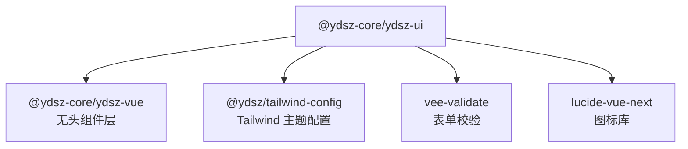

# YDSZ UI —— 有样式业务组件层

> **包名**：`@ydsz-core/ydsz-ui` · **定位**：有样式业务组件层 · **依赖**：`@ydsz-core/ydsz-vue` + Tailwind CSS

## 设计理念

YDSZ UI 是在 YDSZ Vue 无头组件层之上封装的**有样式组件库**，融合 Tailwind CSS 设计令牌，覆盖企业级后台系统所需的全部 UI 元素。

### 三层结构

| 层级 | 定位 | 数量 | 示例 |
|------|------|------|------|
| **Primitives（原子组件）** | 最小可复用 UI 元素 | 80+ | Button / Input / Select / Table / Form / Dialog |
| **Components（业务组件）** | 面向业务场景的高级组合 | 30+ | ProTable / DataTable / ThemeEditor / NotificationBell |
| **Composables（组合式函数）** | 业务逻辑复用 | 27+ | useTableData / useColumnDrag / useNotificationHub |

## 文档导航

| 文档 | 内容 |
|------|------|
| [Primitives 原子组件 API](./primitives.md) | 80+ 组件完整 Props / Emits / Slots / 变体参考 |
| [Composables 组合式函数](./composables.md) | 27+ 函数完整签名与类型定义 |
| [业务组件 + Headless](./components.md) | 30+ 业务组件 + Headless 控制器 + 国际化 locale |

## Primitives 概览

按功能域分类如下：

### 基础输入

| 组件 | 关键能力 |
|------|----------|
| `YdButton` | 9 种 variant + 6 种 size + loading 状态 |
| `YdInput` | prefix/suffix、clearable、showCount、4 种 size |
| `YdInputNumber` | 精度、步进、格式化、number 类型 |
| `YdTextarea` | autosize、resize 控制、字数统计 |
| `YdCheckbox` | indeterminate 半选态 |
| `YdRadioGroup` | Radix 透传 |
| `YdSelect` | 包含虚拟化版本 YdVSelect |
| `YdSwitch` | 开关切换器 |
| `YdAutoComplete` | 本地 + 异步搜索 |
| `YdCascader` | 多级联动、搜索、hover 展开 |
| `YdColorPicker` | 预设色板、格式选择(hex/rgb/hsl)、透明度 |
| `YdDatePicker` | datetime/date/week/month/year/daterange |
| `YdTimePicker` | 12/24 小时制、步进、禁用时间 |
| `YdMention` | @ 触发、自定义前缀 |
| `YdRate` | 半星、只读、count 配置 |
| `YdSlider` | 双值模式 range |
| `YdTreeSelect` | 多选、搜索、联动 |
| `YdUpload` | 分片上传、拖拽、文件列表、自定义请求 |
| `YdForm` | vee-validate + zod、字段校验、防抖校验 |

### 表单校验

| 组件 | 说明 |
|------|------|
| `YdForm` | 表单容器（集成 vee-validate） |
| `YdFormItem` | 表单字段 |
| `YdFormLabel` | 表单标签 |
| `YdFormControl` | 表单控件包装 |
| `YdFormMessage` | 校验错误提示 |

### 数据展示

| 组件 | 说明 |
|------|------|
| `YdTable` | ColumnDef 配置、排序/筛选/选择 |
| `YdCard` | Header/Title/Description/Content/Footer |
| `YdDescriptions` | key-value 描述列表 |
| `YdStatistic` | 统计数值 |
| `YdTimeline` | 时间线 |
| `YdCalendar` | 日历展示 |
| `YdCarousel` | 轮播 |
| `YdList` | 基础列表 |
| `YdCollapse` | 折叠面板（基于 Collapsible） |

### 反馈与弹窗

| 组件 | 说明 |
|------|------|
| `YdDialog` | 模态对话框（9 个子组件） |
| `YdAlertDialog` | 警告对话框 |
| `YdPopover` | 气泡弹出层 |
| `YdTooltip` | 文字提示 |
| `YdHoverCard` | 悬停卡片 |
| `YdPopconfirm` | 确认气泡框 |
| `YdMessage` | 全局消息提示 |
| `YdProgress` | 进度条 |
| `YdResult` | 结果页 |
| `YdTour` | 引导漫游 |

### 导航与布局

| 组件 | 说明 |
|------|------|
| `YdPagination` | 分页器 |
| `YdBreadcrumb` | 面包屑（8 个子组件） |
| `YdTabs` | 标签页 |
| `YdSteps` | 步骤条 |
| `YdAnchor` | 锚点导航 |
| `YdPageHeader` | 页头 |
| `YdSegmented` | 分段控制器 |
| `YdSheet` | 抽屉面板（4 个方向） |

### 展示增强

| 组件 | 说明 |
|------|------|
| `YdAvatar` / `YdAvatarGroup` | 头像（7 种尺寸 + 2 种形状） |
| `YdBadge` | 徽标（8 种变体） |
| `YdTag` | 标签（6 种变体 + 3 种尺寸） |
| `YdCountTag` | 计数徽标 |
| `YdCountdown` | 倒计时 |
| `YdDivider` | 分隔线 |
| `YdSeparator` | 分隔符 |
| `YdToggle` / `YdToggleGroup` | 切换器 |
| `YdResizable` | 可调尺寸面板 |
| `YdSkeleton` | 骨架屏 |
| `YdSpin` | 加载中 |
| `YdEmpty` | 空状态 |
| `YdWatermark` | 水印 |
| `YdQrCode` | 二维码 |
| `YdTypography` | 排版（Title/Text/Paragraph） |

## Composables 概览

| 分类 | Composable | 说明 |
|------|------------|------|
| **表格** | `useTableData` | 排序/筛选/分页/选择/展开全功能 |
| **表格** | `useTableColumnStorage` | 列配置持久化 |
| **表格** | `useColumnDrag` | 列拖拽排序 |
| **虚拟滚动** | `useVirtualList` | 固定/动态高度虚拟列表 |
| **虚拟滚动** | `useTreeVirtual` | 树形虚拟滚动 |
| **交互** | `useNotificationHub` | 通知中心（WebSocket） |
| **交互** | `useOverlayStack` | 弹窗堆叠管理 |
| **交互** | `useDragSort` | 通用拖拽排序 |
| **交互** | `useGridLayout` | 响应式网格布局 |
| **交互** | `useIdleHydrate` | 空闲预注册 |
| **交互** | `useChunkUpload` | 大文件分片上传 |
| **无障碍** | `useA11yChecker` | axe-core 检查 |
| **无障碍** | `useA11yAssertions` | Vitest 断言 |
| **性能** | `useRenderPerformance` | 渲染性能监控 |
| **国际化** | `useComponentI18n` | 组件级国际化 |
| **国际化** | `useLocale` | 全局 locale |
| **回顶** | `useBacktop` | 回到顶部 |

## 业务组件概览

| 组件 | 说明 |
|------|------|
| `YdProTable` | 增强表格（CRUD + 筛选 + 列设置 + 导出） |
| `YdDataTable` | 轻量数据表格 |
| `YdVirtualTable` | 虚拟滚动表格 |
| `YdButtonSmart` | 智能按钮（自动适配变体） |
| `YdAvatarSmart` | 智能头像 |
| `YdDropdownMenuSmart` | 智能下拉菜单 |
| `YdTooltipSmart` | 智能 Tooltip |
| `YdHoverCardSmart` | 智能悬停卡片 |
| `YdAlertBanner` | 告警横幅 |
| `YdAdvancedFilterBar` | 高级筛选栏 |
| `YdDomainFilterPanel` | 领域筛选面板 |
| `YdThemeEditor` | 运行时主题编辑器 |
| `YdNotificationBell` / `YdNotificationPanel` | 通知中心 |
| `YdDashboardGrid` / `YdStatCard` / `YdMiniChart` | 仪表盘组件 |
| `YdQuickCreateButton` | 快速创建按钮 |
| `YdSettingsFloatButton` | 设置浮动按钮 |
| `YdCountToAnimator` | 数字滚动动画 |
| `YdSegmented` | 分段控制器 |

## Headless 控制器

| 名称 | 说明 |
|------|------|
| `useSelectHeadless<T>` | 选择器逻辑抽象 |
| `useTreeHeadless<T>` | 树形组件逻辑抽象 |
| `useTreeDrag<T>` | 树形拖拽排序逻辑 |

## 国际化系统

- **内置语言**: `zh-CN`（默认）、`en-US`
- **命名空间**: `common` / `table` / `form` / `dialog` / `upload` / `pagination` / `datepicker` / `select` / `tree` / `message` / `notification` / `empty`
- **插值语法**: `{placeholder}` 格式
- **RTL 支持**: `isRTL` 属性控制

## 依赖关系

