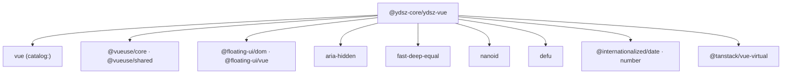

# YDSZ Vue —— 无头组件层

> **包名**：`@ydsz-core/ydsz-vue` · **定位**：零样式 Headless UI 基础层 · **Fork 自**：radix-vue@1.9.17（已内化独立演进）

## 设计理念

YDSZ Vue 是无头（Headless）组件层，聚焦于**行为逻辑**和**无障碍访问**，不包含任何视觉样式。所有外观表现由上层 `@ydsz-core/ydsz-ui` 通过 Tailwind CSS 注入。

### 核心原则

| 原则 | 说明 |
|------|------|
| **零样式** | 组件不输出 color/font/border 等视觉 CSS class，仅提供结构和行为 |
| **Root + Parts 组合** | 每个复合组件由 Root 容器 + 多个 Part 子组件拼装而成 |
| **受控/非受控双模式** | 支持 `v-model` 受控和 props 非受控两种使用方式 |
| **WAI-ARIA 合规** | 键盘导航、焦点陷阱、`role` / `aria-*` 属性完整实现 |
| **可组合性** | 任意 Part 可独立使用，支持插槽（Slot）自定义渲染 |

## 组件清单

共 29 个组件族，覆盖 Headless 组件的完整场景。

### 交互组件

| 组件族 | 子组件 | 说明 |
|--------|--------|------|
| **Accordion** | Root / Item / Header / Trigger / Content | 手风琴折叠面板 |
| **AlertDialog** | Root / Trigger / Portal / Overlay / Content / Title / Description / Action / Cancel | 警告对话框 |
| **Collapsible** | Root / Trigger / Content | 折叠展开组件 |
| **Dialog** | Root / Trigger / Portal / Overlay / Content / Close / Title / Description | 模态对话框 |
| **HoverCard** | Root / Trigger / Portal / Content | 悬停卡片 |
| **Popover** | Root / Anchor / Trigger / Portal / Content / Close / Arrow | 气泡弹出层 |
| **Select** | Root / Provider / Trigger / Value / Icon / Portal / Content / Viewport / Item / ItemText / ItemIndicator / Group / Label / Separator / ScrollUpButton / ScrollDownButton / Arrow / BubbleSelect | 选择器（支持气泡模式） |
| **Tabs** | Root / List / Trigger / Content / Indicator | 标签页 |
| **Tooltip** | Root / Provider / Trigger / Portal / Content / Arrow | 文字提示 |

### 表单组件

| 组件族 | 子组件 | 说明 |
|--------|--------|------|
| **Checkbox** | Root / Indicator | 复选框 |
| **NumberField** | Root / Increment / Decrement / Input | 数字输入步进器 |
| **PinInput** | Root / Input | PIN 码输入 |
| **RadioGroup** | Root / Item / Indicator | 单选按钮组 |
| **Slider** | Root / Track / Range / Thumb / ThumbImpl / Horizontal / Vertical | 滑块 |
| **Switch** | Root / Thumb | 开关切换 |

### 导航与菜单

| 组件族 | 子组件 | 说明 |
|--------|--------|------|
| **ContextMenu** | Root / Trigger / Portal / Content / Group / Item / ItemIndicator / CheckboxItem / RadioItem / RadioGroup / Label / Separator / Sub / SubTrigger / SubContent / Arrow | 右键菜单 |
| **DropdownMenu** | 同 ContextMenu 结构 | 下拉菜单 |
| **Menu** | Root / Anchor / Arrow / Content / Group / Item / ItemImpl / ItemIndicator / Label / Portal / RadioGroup / RadioItem / Separator / Sub / SubTrigger / SubContent | 通用菜单 |
| **Pagination** | Root / List / ListItem / First / Prev / Next / Last / Ellipsis | 分页器 |

### 展示组件

| 组件族 | 子组件 | 说明 |
|--------|--------|------|
| **Avatar** | Root / Image / Fallback | 头像 |
| **Label** | Root | 表单标签 |
| **Progress** | Root / Indicator | 进度条 |
| **ScrollArea** | Root / Viewport / Corner / CornerImpl / Scrollbar / Thumb / ScrollbarX / ScrollbarY | 自定义滚动条区 |
| **Separator** | Root | 分隔符 |
| **Tree** | Root / Item / Virtualizer | 树形组件（支持虚拟滚动） |

### 布局与切换

| 组件族 | 子组件 | 说明 |
|--------|--------|------|
| **Splitter** | Group / Panel / ResizeHandle | 可拖拽分割面板 |
| **Toggle** | Root | 切换按钮（受 press 状态驱动） |
| **ToggleGroup** | Root / Item | 切换按钮组（单选/多选模式） |

## composables（ydsz 业务特化）

| Composable | 说明 |
|------------|------|
| `useControlledState` | 受控/非受控状态统一封装，自动处理 `v-model` 与内部状态切换 |
| `useDebouncedSearch` | 带防抖的搜索输入，返回搜索词 + loading 状态 |
| `useTenantAwareSelection` | 租户感知的选择器多选逻辑，切换租户自动清空已选 |

## 工具函数（shared 模块）

通过 `@ydsz-core/ydsz-vue` 导出的一工具函数列表：

| 分类 | 函数 | 说明 |
|------|------|------|
| **组件原语** | `Primitive` | 通用原语组件，`as` 属性动态渲染标签 |
| **组件原语** | `Slot` | 子组件插槽透传 |
| **组件原语** | `VisuallyHidden` | 视觉隐藏但可被屏幕阅读器识别 |
| **组件原语** | `usePrimitiveElement` | 获取组件根元素引用 |
| **状态创建** | `createContext` | 创建 provide/inject 上下文（类型安全泛型） |
| **状态创建** | `useStateMachine` | 有限状态机（enter → leave 动画控制） |
| **Props 转发** | `useForwardProps` | 自动转发 attrs 为 props |
| **Props 转发** | `useForwardPropsEmits` | 转发 props + emits（merge 冲突处理） |
| **Props 转发** | `useForwardExpose` | 自动转发组件暴露方法 |
| **Props 转发** | `useEmitAsProps` | 将 emit 事件转换为 props 传递 |
| **浏览器** | `useBodyScrollLock` | 锁定页面滚动（弹窗场景） |
| **浏览器** | `useDirection` | RTL/LTR 方向检测 |
| **无障碍** | `useArrowNavigation` | 键盘方向键导航（列表/网格场景） |
| **无障碍** | `useFocusGuards` | 焦点守卫（弹窗焦点陷阱辅助） |
| **ID 生成** | `useId` | 唯一 ID 生成（SSR Safe） |
| **默认值** | `withDefault` | props 默认值处理 |
| **日期** | `useDateFormatter` | 国际化日期格式化（`Intl.DateTimeFormat` 封装） |
| **尺寸** | `useSize` | 元素尺寸监听（ResizeObserver） |
| **Kbd** | `useKbd` | 键盘符号映射（跨平台自动适配） |
| **类型** | `Formatter` (type) | DateFormatter 配置类型 |
| **类型** | `DateRange` (type) | 日期范围类型 |
| **类型** | `PrimitiveProps` (type) | Primitive 组件 props 定义 |

## Primitive 组件用法

`Primitive` 是 YDSZ Vue 的基础原语组件，所有组件最终由它渲染：

```vue
<script setup lang="ts">
import { Primitive } from '@ydsz-core/ydsz-vue'
</script>

<!-- 渲染为 div（默认） -->
<Primitive>内容</Primitive>

<!-- 渲染为 button -->
<Primitive as="button" @click="handleClick">点击</Primitive>

<!-- 渲染为动态组件 -->
<Primitive :is="condition ? 'a' : 'span'">动态</Primitive>
```

## 使用示例

### 基本导入方式

```vue
<script setup lang="ts">
import {
  AccordionRoot,
  AccordionItem,
  AccordionTrigger,
  AccordionContent,
} from '@ydsz-core/ydsz-vue'
</script>

<template>
  <AccordionRoot type="single" collapsible>
    <AccordionItem value="item-1">
      <AccordionTrigger>标题</AccordionTrigger>
      <AccordionContent>折叠内容</AccordionContent>
    </AccordionItem>
  </AccordionRoot>
</template>
```

### 受控/非受控模式

```vue
<script setup lang="ts">
import {
  PopoverRoot,
  PopoverTrigger,
  PopoverContent,
} from '@ydsz-core/ydsz-vue'
import { ref } from 'vue'

const isOpen = ref(false)
</script>

<!-- 非受控模式（内部维护状态） -->
<template>
  <PopoverRoot>
    <PopoverTrigger>打开</PopoverTrigger>
    <PopoverContent>弹出内容</PopoverContent>
  </PopoverRoot>
</template>

<!-- 受控模式（v-model 驱动） -->
<template>
  <PopoverRoot v-model:open="isOpen">
    <PopoverTrigger>打开</PopoverTrigger>
    <PopoverContent>弹出内容</PopoverContent>
  </PopoverRoot>
</template>
```

## 与 YDSZ UI 的关系

| 层 | 输入 | 输出 |
|----|------|------|
| **YDSZ Vue**（本层） | 用户交互事件 | 暴露的 Slot props / expose 方法 |
| **YDSZ UI**（上层） | 使用 YDSZ Vue 组件 + 传递 Slot | 添加 Tailwind CSS class 实现视觉样式 |

## 依赖关系


