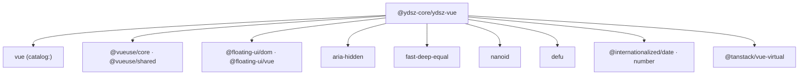

# YDSZ Vue —— 无头组件层

> **包名**：`@ydsz-core/ydsz-vue` · **定位**：零样式 Headless UI 基础层 · **Fork 自**：radix-vue@1.9.17

## 设计理念

YDSZ Vue 是无头（Headless）组件层，聚焦于**行为逻辑**和**无障碍访问**，不包含任何视觉样式。

### 核心原则

| 原则 | 说明 |
|------|------|
| **零样式** | 不输出 color/font/border 等视觉 CSS class，仅提供结构和行为 |
| **Root + Parts 组合** | 每个复合组件由 Root 容器 + 多个 Part 子组件拼装 |
| **受控/非受控双模式** | 支持 `v-model` 受控和 props 非受控两种使用方式 |
| **WAI-ARIA 合规** | 键盘导航、焦点陷阱、`role` / `aria-*` 属性完整实现 |
| **可组合性** | 任意 Part 可独立使用，支持插槽（Slot）自定义渲染 |

## 文档导航

| 文档 | 内容 |
|------|------|
| [组件 API 参考](./components.md) | 29 个组件族的完整 Props / Events / Slots / Expose |
| [Composables & 工具函数](./utilities.md) | 3 个业务 composable + 21+ 工具函数 + 共享类型 |

## 组件族概览

共 **29 个**组件族，覆盖 Headless 组件的完整场景。

### 交互组件

| 组件族 | 子组件 | 说明 |
|--------|--------|------|
| **Accordion** | Root / Item / Header / Trigger / Content | 手风琴折叠面板 |
| **AlertDialog** | Root / Trigger / Portal / Overlay / Content / Title / Description / Action / Cancel | 警告对话框 |
| **Collapsible** | Root / Trigger / Content | 折叠展开组件 |
| **Dialog** | Root / Trigger / Portal / Overlay / Content / Close / Title / Description | 模态对话框 |
| **HoverCard** | Root / Trigger / Portal / Content | 悬停卡片 |
| **Popover** | Root / Anchor / Trigger / Portal / Content / Close / Arrow | 气泡弹出层 |
| **Select** | Root / Provider / Trigger / Value / Icon / Portal / Content / Viewport / Item / ItemText / ItemIndicator / Group / Label / Separator / ScrollUpButton / ScrollDownButton / Arrow / BubbleSelect | 选择器 |
| **Tabs** | Root / List / Trigger / Content / Indicator | 标签页 |
| **Tooltip** | Root / Provider / Trigger / Portal / Content / Arrow | 文字提示 |

### 表单组件

| 组件族 | 子组件 | 说明 |
|--------|--------|------|
| **Checkbox** | Root / Indicator | 复选框 |
| **NumberField** | Root / Increment / Decrement / Input | 数字输入步进器 |
| **PinInput** | Root / Input | PIN 码输入 |
| **RadioGroup** | Root / Item / Indicator | 单选按钮组 |
| **Slider** | Root / Track / Range / Thumb / ThumbImpl / Horizontal / Vertical | 滑块 |
| **Switch** | Root / Thumb | 开关切换 |

### 导航与菜单

| 组件族 | 说明 |
|--------|------|
| **ContextMenu** | 右键菜单（17 个子组件，同 Menu 结构） |
| **DropdownMenu** | 下拉菜单（16 个子组件，同 Menu 结构） |
| **Menu** | 通用菜单（22 个子组件） |
| **Pagination** | 分页器（Root + 7 个子组件） |

### 展示与布局

| 组件族 | 子组件 | 说明 |
|--------|--------|------|
| **Avatar** | Root / Image / Fallback | 头像 |
| **Label** | Root | 表单标签 |
| **Progress** | Root / Indicator | 进度条 |
| **ScrollArea** | Root / Viewport / Corner / CornerImpl / Scrollbar / Thumb / ScrollbarX / ScrollbarY | 自定义滚动条区 |
| **Separator** | Root | 分隔符 |
| **Tree** | Root / Item / Virtualizer | 树形组件（支持虚拟滚动） |
| **Splitter** | Group / Panel / ResizeHandle | 可拖拽分割面板 |
| **Toggle** | Root | 切换按钮 |
| **ToggleGroup** | Root / Item | 切换按钮组 |

## composables（业务特化）

| Composable | 说明 |
|------------|------|
| `useControlledState` | 受控/非受控状态统一封装 |
| `useDebouncedSearch` | 带防抖的搜索输入 |
| `useTenantAwareSelection` | 租户感知的选择器多选逻辑 |

## 依赖关系

