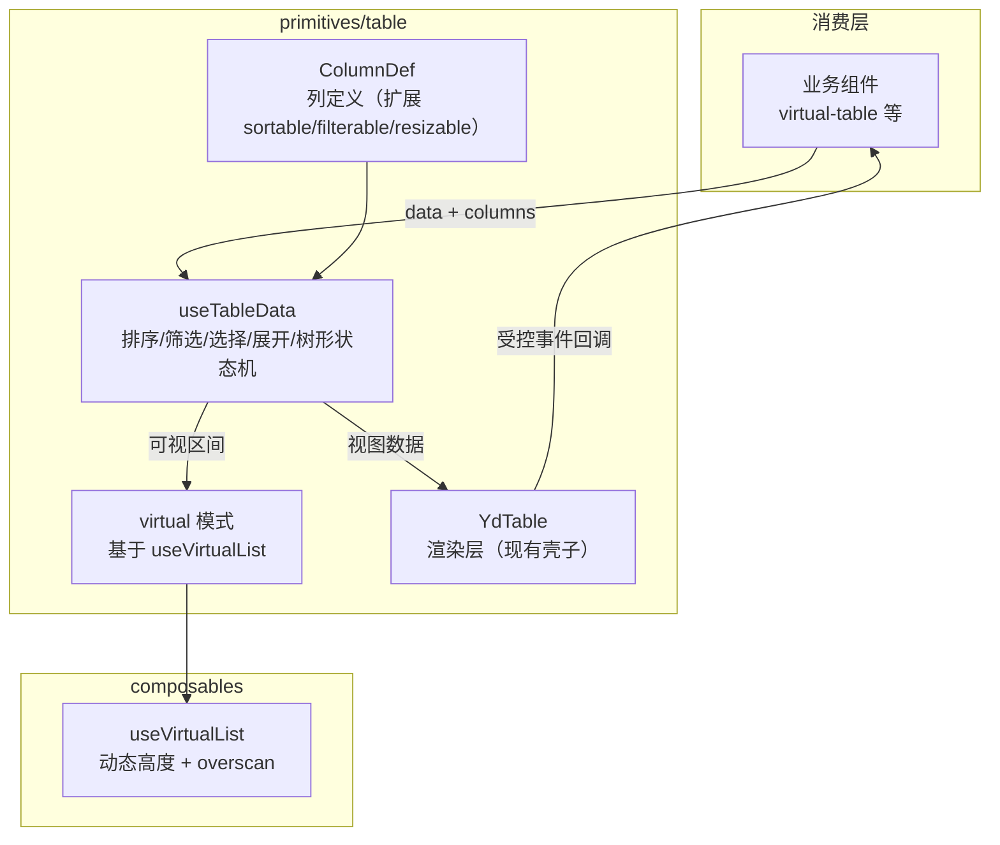
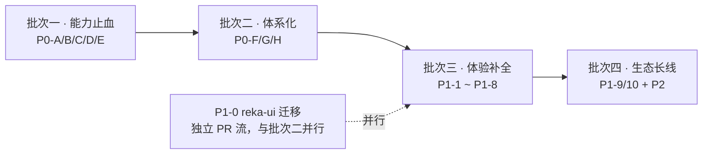

# ydsz-ui 基础组件优化优先级清单与改进方案

> 编制日期：2026-09-17
> 上游依据：`docs/component-benchmark-88.md`（竞品对标报告）+ 2026-09-17 全量源码审计
> 适用范围：`comm/@core/ui-kit/ydsz-ui` v5.5.9，primitives 层 88 个基础组件
> 读者：组件库维护者、前端架构师、业务线前端负责人

---

## 一、基线校准

竞品对标报告（component-benchmark-88.md）成文后，组件库有一轮集中开发。对照当前源码，原报告的 6 项 P0 中有 3 项状态已发生变化，直接影响优先级排序。本节先修正基线，后续方案全部基于校准后的事实。

| 原报告编号 | 原判断 | 当前源码状态 | 结论 |
|-----------|--------|-------------|------|
| P0-1 ConfigProvider 缺失 | 完全缺失 | `primitives/config-provider/YdConfigProvider.vue` 已存在，支持 disabled / size / prefixCls / locale / empty 渲染 / wave 覆盖 | 降级：从"新建"改为"打通" |
| P0-2 Token 运行时切换缺失 | 要重编译 | `theme/theme-schema.ts` 已有 token 注册表（cssVar / 类别 / 默认值 / 暗色值），`useTheme` 经 `style.setProperty` 写 CSS 变量，dark / light / compact 三预设可用 | 降级：从"新建"改为"三层化" |
| P0-6 国际化硬编码 | 无外部化 | `useSimpleLocale` 已存在，date-picker 已接入（i18n 覆盖 1/88 组件） | 保持高优：从"起步"推向"全局" |
| — （原报告未覆盖） | — | date-picker 新增 range 模式（两点状态机 + 区间高亮预览）与 date-picker 级 i18n | 已完成部分能力，剩余粒度缺口见 P0-B |
| — （原报告未覆盖） | — | `composables/use-chunk-upload.ts` 及其测试已存在，但尚未接入 `YdUpload` 组件层 | 原 P1-2 "Upload 切片上传"从零开始的判断过时，改为"接线" |
| — （原报告未覆盖） | — | 命令式 toast API 落在 `comm/effects/notification`（use-toast / toast-state），与 primitives/message 声明式组件形成架构分裂 | 新增高优项 P0-C |
| — （原报告未覆盖） | — | cascader / tree-select / time-picker 已在源码并已导出，但无测试无 stories，属未验收在制品 | 新增验收项 P0-D |

另有一项外部依赖变化必须纳入：radix-vue 已于 2025 年更名为 reka-ui（当前 v2.x），上游以 reka-ui 为演进主线；本库当前有 60 个文件直接引用 radix-vue `[Research-backed]`。这是原报告完全未识别的技术债，列入 P1 首位。

质量现状（2026-09-17 审计口径）：测试文件 17 个（含 composables / headless 层，组件级覆盖约 15%）、stories 18 个（约 18%）、aria 属性覆盖 68 个文件共 143 处。原报告"79% 组件零文档零测试"的判断在复合组件大头（sheet / dropdown-menu / context-menu）上仍然成立 `[Data-backed]`。

---

## 二、优先级清单

排序依据三个变量：业务收益（B 端日常开发的阻塞程度）、竞品差距（对标 EP / Ant Design Vue / Naive UI 的深度缺口）、交付成本。质量门禁（测试 + stories）不单列为一项，而是并入每项交付物的验收标准——单独立项容易沦为突击补文档，随功能走才能持续。

### P0 · 能力止血（第一批）

| 编号 | 事项 | 差距依据 | 预期产出 |
|------|------|---------|---------|
| P0-A | Table 数据层 | YdTable 无排序 / 筛选 / 行选择状态机 / 树形 / 汇总，固定列仅 sticky；虚拟化孤岛在业务层 virtual-table | useTableData + ColumnDef 扩展 + virtual 模式合并 |
| P0-B | DatePicker 粒度矩阵 | DatePickerType 仅 `date / datetime / range` 三种，竞品为 8+ 粒度含 week / month / quarter / year 及各 range 变体 | 粒度扩展 + 独立 date-utils + shortcuts 面板 |
| P0-C | 命令式反馈收敛 | primitives/message 仅声明式单条组件；命令式 API 游离在 effects/notification，两套体系 | message / notification 函数式 API 入驻 ydsz-ui，消除分裂 |
| P0-D | 在制品验收转正 | cascader / tree-select / time-picker 已导出但零测试零 stories | 三组件补齐交互 / a11y / 虚拟化验收 |
| P0-E | Input 系细节 | input / textarea 为裸壳，无 clearable / prefix / suffix / autosize | 输入组件族补齐竞品标配 props |

### P0 · 体系化（第二批）

| 编号 | 事项 | 差距依据 | 预期产出 |
|------|------|---------|---------|
| P0-F | Token 三层化 | theme-schema 有注册表但无 base → semantic → 组件命名空间分层，组件级覆盖能力弱 | 三层 token schema + preset 注册机制 + 密度档位 |
| P0-G | i18n 全局化 | useSimpleLocale 已存在但仅覆盖 date-picker（1/88） | ConfigProvider.locale ↔ 词典打通，首批 zh-CN / en-US 覆盖高频组件 |
| P0-H | Form 校验链路 | vee-validate 集成起步，缺 validateOn 分档 / dependencies 联动 / 异步去抖 | 校验时机配置 + 跨字段联动 + 错误聚焦 |

### P1 · 体验与技术债（第三批，可部分并行）

| 编号 | 事项 | 说明 |
|------|------|------|
| P1-0 | radix-vue → reka-ui 迁移 | 60 文件引用，官方有迁移指南；依赖已停止演进的下游风险 > 迁移成本 |
| P1-1 | Table 列拖拽 / 列宽调整 / 列显隐 | 依赖 P0-A 的 ColumnDef 扩展 |
| P1-2 | Upload 切片上传接线 | use-chunk-upload 已存在，接入 YdUpload UI 层与进度展示 |
| P1-3 | Tree 拖拽 / 懒加载 / 全选 | 基于 use-tree-headless 补齐 |
| P1-4 | Tabs 溢出滚动 / 可关闭 / 可新增 | 当前为 radix 纯转发 |
| P1-5 | AutoComplete 异步搜索 / 防抖 | 集成 useDebounceFn |
| P1-6 | 虚拟滚动家族化 | useVirtualList 接入 tree / cascader / tree-select / transfer / dropdown |
| P1-7 | Tour 定位引擎 | 当前固定遮罩 + z-[60]，换 popover 定位 |
| P1-8 | 尺寸档位（mini/small/default/large） | 经 ConfigProvider 全局切换 |
| P1-9 | 文档站 + Playground（VitePress） | stories 仅 18% 组件，无对外文档 |
| P1-10 | A11y CI 卡点 | axe-core 入 PR 流水线 |

### P2 · 长线（第四批）

沿用原报告 P2 方向（motion 体系、嵌套弹窗管理器、SSR 验证、508 审计、微前端共享、低代码物料、Figma 同步、AI 辅助），本文档不展开。仅补充一项：

| 编号 | 事项 | 说明 |
|------|------|------|
| P2-10 | exports 脚本化生成 | package.json 88+ 条手工维护 exports（index.ts 注释自述"最容易漏掉的一步"），改为脚本从目录生成 |

---

## 三、P0 具体方案

### P0-A Table 数据层

#### 目标与边界

职责：给 YdTable 补数据层状态机（排序 / 筛选 / 行选择 / 展开 / 树形 / 汇总），并把业务层 virtual-table 的虚拟化能力下沉合并。不包含：列拖拽（P1-1）、编辑单元格（暂缓，等数据层稳定后评估）、服务端分页协议（由业务层组合，组件只暴露受控回调）。

#### 架构



数据流单向：业务方传入原始 `data` 与 `columns`，useTableData 内部维护排序键、筛选条件、选中行集合、展开行集合、树形展开节点的响应式状态，产出视图数据（排序后 + 筛选后 + 展开拍平后的行数组）交给渲染层。渲染层不持有任何数据状态，只消费视图数据与触发事件。虚拟模式不单独成组件，而是 YdTable 的一个 prop，内部走 useVirtualList 计算可视行区间——这消除了"两个表格组件"的心智负担 `[Expert judgment]`。

#### 接口契约

ColumnDef 新增字段（全部可选，向后兼容）：

| 字段 | 类型 | 约束 | 说明 |
|------|------|------|------|
| `sortable` | `boolean` | 默认 false | 表头显示排序指令，点击切换 asc → desc → 取消 |
| `sorter` | `(a, b) => number` | 与 sortable 连用 | 本地排序比较函数；不传则按字典序 |
| `filters` | `{ text, value }[]` | 可选 | 表头筛选菜单选项 |
| `filterMethod` | `(value, row) => boolean` | 与 filters 连用 | 本地筛选谓词 |
| `resizable` | `boolean` | 默认 false | P1-1 实现，字段先占位 |

YdTable 新增 props：

| Prop | 类型 | 默认 | 说明 |
|------|------|------|------|
| `virtual` | `boolean` | false | 开启行虚拟滚动，超过 200 行时建议开启 |
| `rowSelection` | `{ selectedRowKeys, onChange, type: 'checkbox' \| 'radio' }` | — | 行选择受控配置，与现有 selection 列类型对接 |
| `defaultExpandAllRows` | `boolean` | false | 树形数据默认全展开 |
| `summary` | `(data) => SummaryRow[]` | — | 汇总行渲染函数，渲染在表体尾部 |

emits 新增：`sort-change`、`filter-change`、`selection-change`、`expand-change`，均为受控回调，业务方可用于服务端排序 / 筛选场景（此时传 `remote` prop 关闭本地状态机）。

useTableData 签名：

```ts
function useTableData<T>(
  source: MaybeRefOrGetter<T[]>,
  columns: MaybeRefOrGetter<ColumnDef[]>,
  options?: { remote?: boolean; childrenKey?: string; rowKey?: string }
): {
  viewRows: ComputedRef<T[]>;
  sortState: Ref<{ key: string; order: 'asc' | 'desc' | null }>;
  selection: Ref<Set<string>>;
  expandedKeys: Ref<Set<string>>;
}
```

#### 迁移与兼容

现有 16 个 table 相关文件不动结构，渲染层改造集中在 YdTable.vue / YdTableColumn.vue。`components/virtual-table/YdVirtualTable` 保留为薄别名并标记 deprecated，一个 major 版本后移除。monorepo 内消费方走源码（exports 指向 src），改动即时生效，因此每个能力点独立 PR + 测试先行 `[Data-backed：package.json exports 现状]`。

#### 验收标准

排序三态切换、多列筛选叠加、跨页选择保持、树形异步加载、汇总行渲染各有行为测试；virtual 模式下 1 万行数据首屏渲染无可感知卡顿（以 useVirtualList 现有能力为基线）；stories 覆盖以上全部场景。

### P0-B DatePicker 粒度矩阵

当前 `DatePickerType = 'datetime' | 'date' | 'range'`，扩展为：

```ts
export type DatePickerType =
  | 'date' | 'datetime' | 'week' | 'month' | 'quarter' | 'year'
  | 'daterange' | 'datetimerange' | 'monthrange' | 'yearrange';
```

方案分两层：

**date-utils 模块**（`primitives/date-picker/date-utils.ts`，纯函数、无 Vue 依赖）：解析 / 格式化 / startOf / endOf / 周对齐 / 粒度切换（面板月份 → 年份视图的跳转）。引入 dayjs 作为该模块内部依赖（对外 API 仍接受 `Date | string`，不暴露 dayjs 类型），理由：周起始日随 locale 变化、季度边界、闰年等规则是高频出错点，自研的测试成本高于引入一个 2KB 的成熟库 `[Expert judgment]`。

**面板粒度状态机**：YdCalendarPanel 已有月视图骨架，增加视图层级状态（day → month → year，点击表头逐级上翻），range 变体复用已实现的"两点状态机 + 悬停预览"——把现有 date 级区间逻辑参数化为任意粒度区间。shortcuts 以 prop 传入（`shortcuts?: { text: string; value: () => [Date, Date] }[]`），渲染在面板左侧栏。

验收：10 种粒度 × 单选 / 区间的全组合 stories；周起始日随 locale 切换正确；i18n 词条沿用已接入的 useSimpleLocale 体系扩展。

### P0-C 命令式反馈收敛

现状是两套体系：primitives/message 的声明式单条组件（无 teleport、无队列、无 z-index 管理）与 effects/notification 的 use-toast（命令式但位置错误——在应用效果层而非组件库）。收敛目标：命令式 API 以组件库为一等公民位置，effects 层桥接过渡。

```mermaid
graph TB
    subgraph ydsz-ui
        CP["YdConfigProvider<br/>locale / theme / 全局配置"]
        MP["MessageProvider<br/>队列 + teleport 容器 + z-index"]
        API["message.success() 等快捷方法<br/>模块级注册表（脱离上下文时的降级入口）"]
        UM["useMessage()<br/>Composable（优先取上下文实例）"]
    end
    subgraph effects/notification（过渡桥）
        BR["use-toast<br/>re-export 桥接，标记 deprecated"]
    end
    CP --> MP
    UM -->|inject| MP
    API -.->|无 Provider 时自建容器| MP
    BR -.-> UM
```

设计要点：`useMessage()` 经 inject 取 Provider 实例，未挂 Provider 时模块级注册表自动创建独立容器（对应 naive 的 discrete API 模式），保证任何调用点可用 `[Expert judgment：这是竞品通行的双入口解法]`。API 形态对齐已落地的轻量 toast：双入参重载（`message(content, options?)` 与 `message({ ... })`）、success / error / warning / info 快捷方法、返回句柄支持手动关闭。

message 与 notification 同构处理（notification 多 placement 与堆叠方向参数）。effects/notification 的 use-toast 改为 re-export 桥接并标 deprecated，一个 major 版本后移除，给业务方留迁移窗口。

验收：命令式调用脱离组件上下文可用；同类型消息聚合（连续调用合并计数）；z-index 由统一浮层管理而非硬编码；队列上限与溢出策略可配置。

### P0-D 在制品验收转正

cascader / tree-select / time-picker 三个组件已导出但未经系统验收。转正清单（三组件同一标准）：

1. 键盘导航：方向键移动高亮、Enter 选中、Esc 关闭、Tab 循环——cascader 与 tree-select 按 listbox / combobox 模式实现，time-picker 已有较多 aria 标记（11 处，88 组件中最高 `[Data-backed]`），以其为基准反推另两个
2. 大数据：接入 useVirtualList（选项 > 200 条自动启用），cascader 还需懒加载子级（异步 loadChildren）
3. 受控 / 非受控双模式回归
4. 行为测试 + stories 各一套（含键盘用例与 1000 节点长列表用例）

### P0-E Input 系细节

input / textarea 当前为裸壳（仅 modelValue 双向绑定）。补齐 props（全部增量、无破坏）：

- `clearable`（含受控清空回调）、`prefix` / `suffix`（slot + prop 双入口）、`disabled` / `readonly` 状态样式
- input-number 已有的键盘步进模式为参照，input 增加 `maxlength` 计数展示可选项
- textarea：`autosize`（`boolean | { minRows, maxRows }`，基于 scrollHeight 计算实现）、`resize` 控制
- 业务层 `input-password` 的可见性切换逻辑下沉为 input 的 `type` 动态切换能力

### P0-F Token 三层化

现有 theme-schema 是单层注册表（token → cssVar / 默认值 / 暗色值）。目标结构：

```text
base 层      --yd-color-primary-600 等原始色阶（设计侧维护）
semantic 层  --yd-primary / --yd-bg-soft / --yd-text-muted（现有语义色归入此层）
component 层 --yd-table-header-bg / --yd-select-item-hover 等（引用 semantic 层）
```

改造方式：theme-schema 增加 `layer: 'base' | 'semantic' | 'component'` 字段与 `ref`（component 层 token 声明其引用的 semantic token），useTheme 应用 preset 时按 base → semantic → component 顺序写入。组件级覆盖走 ConfigProvider 的 `themeOverrides` prop，按组件命名空间合并。密度档位（compact 已有）扩展为 normal / compact / loose 三档作用于 spacing 类 token。dark / light / compact 三预设机制保持不变，只是预设内容随分层扩充 `[Expert judgment]`。

### P0-G i18n 全局化

路径：ConfigProvider 的 `locale` prop（字段已存在）作为入口，provide 组件库词典上下文；`src/locale/` 集中管理 `zh-CN.ts` / `en-US.ts`，词条按组件命名空间组织；组件内统一经 `useLocale('pagination')` 取词（date-picker 已走的 useSimpleLocale 迁移到同一入口，保持向后兼容导出）。首批覆盖高频文案组件：pagination、table（空数据 / 筛选确认）、upload（状态文案）、message / notification（按钮）、date-picker（已完成的词条平移）。

### P0-H Form 校验链路

保留 vee-validate 底座不换（已有 FieldContext 集成与错误展示，切换 async-validator 的收益不抵重写成本 `[Expert judgment]`）。补三块：

1. 校验时机分档：YdForm 暴露 `validateOn: 'blur' | 'change' | 'input' | 'submit'`（默认 submit），映射到 vee-validate 的字段级触发配置
2. 跨字段联动：`dependencies: string[]` 声明字段依赖，被依赖字段变更时触发本字段重校验
3. 异步校验去抖：`validateDebounce: number`，异步 rule 自动包裹 debounce；提交时 `scrollToError` + 首个错误字段聚焦

---

## 四、落地批次与迁移策略



批次依赖说明：批次一是纯增量能力，无前置依赖，且直接缓解业务侧最高频的痛点；批次二的 token 三层化会触碰全部组件的样式变量引用，放在能力项之后是为了避免大面积样式重构与功能开发交错；reka-ui 迁移是机械性改名 + prop 名对齐（官方提供迁移指南 `[Research-backed]`），独立 PR 流推进，不与功能开发抢同一批文件——它改动的是 import 与组件名，功能开发改的是组件内部逻辑，冲突面小。

发布与兼容纪律：

- monorepo 内消费方直接引用源码，无构建产物缓冲，任何 primitives 改动即时传播到全部业务线 `[Data-backed]`。因此每项能力独立 PR，测试与 stories 作为合并前置条件，不走"先合后补"
- 版本节奏经 changesets 管理：能力项走 minor；YdVirtualTable 别名废弃、use-toast 桥接下线这类破坏性变更走 major，并保留一个版本的 deprecated 过渡
- 每个批次收尾在 1~2 个业务模块先行灰度验证（沿用原报告建议：system / userinfo / workflow 高频模块优先），再放开

---

## 五、风险与依赖

| 风险 | 等级 | 应对 |
|------|------|------|
| radix-vue 上游停止演进，安全修复与新特性断供 | 高 | P1-0 迁移前置到第三批并行启动；迁移前新组件一律直接用 reka-ui 写法，避免增量债务 |
| vee-validate 与自研 headless 层的边界模糊（form 体系出现两套心智） | 中 | P0-H 落地时在文档站明确分工：vee-validate 管校验状态机，headless 管选择类状态；交叉场景以 form 为准 |
| Token 三层化触碰全部组件的变量引用，回归面大 | 中 | component 层 token 先从 table / select 两个高优组件试点，验证覆盖机制后再批量推进 |
| 源码分发无构建缓冲，改动即时影响业务线 | 中 | 独立 PR + 测试前置的纪律（见第四节）；中期以 exports 脚本化 + 构建产物（P2-10 及后续）建立隔离层 |
| Table 数据层与既有 virtual-table 业务用法冲突 | 低 | virtual-table 保留别名一个 major 版本；迁移期间两套 API 并行 |
| 人力投入假设未与团队容量对齐 | 中 | 批次一能力项可按 P0-A → P0-C → P0-B → P0-D/E 的顺序拆分投入，中断点清晰 `[Hypothesis：具体排序待与团队确认]` |

---

## 六、与差异化优势的关系

三项能力在竞品中没有对应物，是这套库的独特资产而非追赶项，优化过程中保持投入而不是向竞品看齐：业务复合组件层（advanced-filter / entity-card / domain-filter / quick-create 等 35 个）；useIdleHydrate 懒水合（requestIdleCallback + IntersectionObserver 延迟挂载）；微前端内核联动（主题与消息经 kernel 共享）。本轮全部 P0 / P1 方案均不触碰这三项的架构位置——Table 数据层完成后，virtual-table 等业务组件作为其上层消费者受益。
